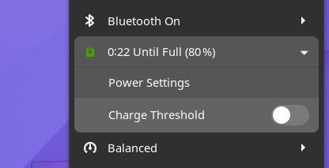
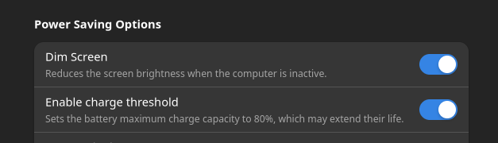

# Package: gnome-battery-charge-manager
Daemon application, for changing (laptop) battery charge threshold through gsettings.

Application is quite simple, it checks whether boolean ```battery-charge-threshold-enabled``` inside ```/org/gnome/BatteryChargeManager```
is set or not, and changes ```/sys/class/power_supply/BAT*/charge_control_end_threshold``` for all installed batteries accordingly.

This method, requires permission and ownership change of those files, thus we have udev rule and systemd services shipped.

# Integrations with GNOME

This package can be integrated with gnome-control-center or gnome-shell (for example via plugin).
Those integrations were proposed to GNOME team to review (and i hope they will be implemented).

#### GNOME Shell Integration
For now, non-invasive [gnome-battery-charge-shell-extension](https://github.com/Xoliper/gnome-battery-charge-shell-extension) integration is advised.  
<p align="center">
  
</p>

#### GNOME Control Center Integration
Or, you can compile my fork (or use preview release) of [gnome-control-center](https://github.com/Xoliper/gnome-control-center).
<p align="center">
  
</p>

# Installation

To build this project you will need following libraries and tools installed (versions below were tested, there is a chance lower versions will work):
```
  dependency('gio-2.0', version: '>= 2.72.3')
  dependency('libudev', version: '>= 251')
  meson_version: '>= 0.59.0',
```

### Build & Install

This project is using meson build system, which is preffered by GNOME community.
Follow instructions below to build it:

```
git clone -b main https://github.com/Xoliper/gnome-battery-charge-manager.git
cd ./gnome-battery-charge-manager
meson setup builddir && cd builddir
ninja install
```

### Uninstall

In case of uninstalling this application, bacause of meson nature, we need to cleanup services manually:
```
systemctl --user disable gnome-battery-charge-manager.service
sudo systemctl disable udev-power-supply-trigger.service
```
